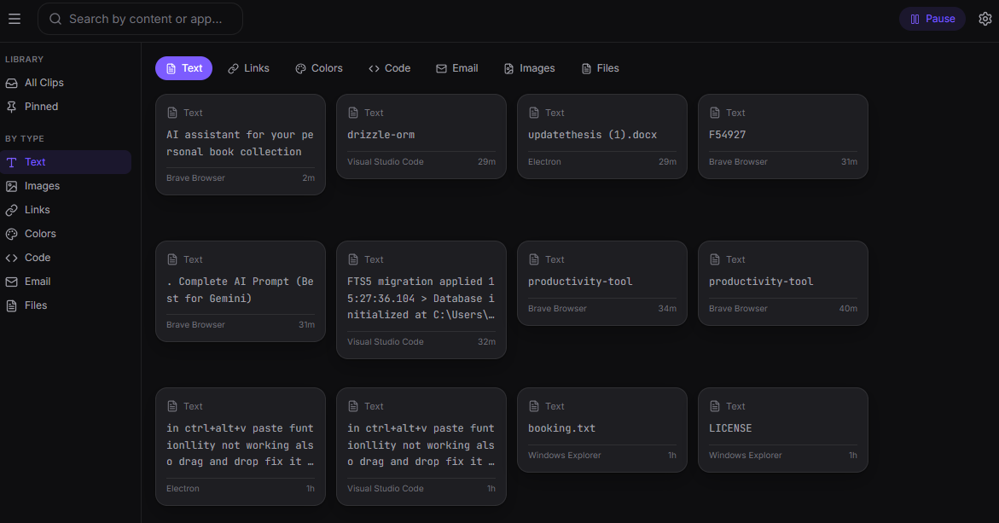

# Clipboard Manager


Local-first clipboard history and screenshot manager for Windows.

## Privacy

**100% local.** All clipboard data stays on your device. Nothing is sent to any server. The app does not collect analytics, telemetry, or usage data. The only outbound network calls are for auto-updates and optional license validation.

## Installation

```bash
npm install
cd node_modules\better-sqlite3
npx prebuild-install --runtime electron --target 39.8.10
npm run dev
```

To build the installer:

```bash
npm run build
npm run dist
```

## Features

- **Clipboard history** — text, URLs, colors, code, emails, images, files
- **Quick-paste overlay** (`Ctrl+Alt+V`) — fuzzy search, pick, paste
- **Screenshot capture** (`Ctrl+Alt+S`) — drag region, auto-save to library
- **Floating shelf** — top-center bar, hover to see recent clips
- **Sensitive content detection** — password managers, credit cards, API keys
- **Free tier** — last 50 clips; license unlocks unlimited history
- **Dark/Light theme** — follows system preference

## Hotkeys

| Key | Action |
|---|---|
| `Ctrl+Alt+V` | Open quick-paste overlay |
| `Ctrl+Alt+L` | Toggle Library window |
| `Ctrl+Alt+S` | Screenshot region capture |
| `Ctrl+Alt+0-9` | Paste recent clip slot |

## Tech Stack

Electron 39 · React 19 · TypeScript · Tailwind CSS · SQLite (better-sqlite3 + FTS5) · Zustand · Framer Motion

## Data Storage

- Database: `%APPDATA%\clipboard-manager\clips.db`
- Image blobs: `%APPDATA%\clipboard-manager\blobs\`
- Settings: `%APPDATA%\clipboard-manager\settings.json`
- Logs: `%APPDATA%\clipboard-manager\logs\`

## Contributing

Contributions are welcome! Whether it's bug reports, feature requests, or code changes, feel free to get involved.

### Getting Started

1. Fork the repository
2. Clone your fork: `git clone https://github.com/your-username/clipboard-manager.git`
3. Install dependencies: `npm install`
4. Build SQLite for Electron: 
   ```bash
   cd node_modules\better-sqlite3
   npx prebuild-install --runtime electron --target 39.8.10

## Development

```bash
npm run dev          # Start with hot reload
npm test             # Run unit tests
npm run build        # Production build
npm run dist         # Build installer
```

## License

MIT — see [LICENSE](LICENSE).
